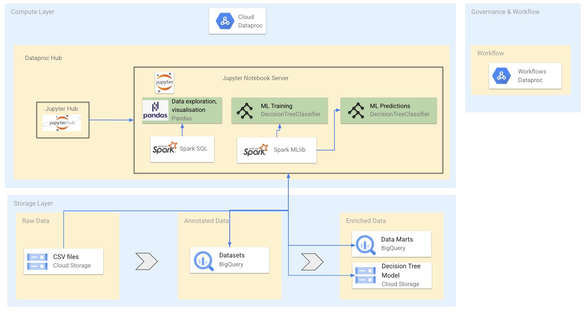

# Welcome to the Datalake Demo 

    Copyright 2020 Google LLC

    Licensed under the Apache License, Version 2.0 (the "License");
    you may not use this file except in compliance with the License.
    You may obtain a copy of the License at

     https://www.apache.org/licenses/LICENSE-2.0

    Unless required by applicable law or agreed to in writing, software
    distributed under the License is distributed on an "AS IS" BASIS,
    WITHOUT WARRANTIES OR CONDITIONS OF ANY KIND, either express or implied.
    See the License for the specific language governing permissions and
    limitations under the License.




# Apache Spark on Dataproc - Datalake Demo

Apache Spark on Dataproc provides features to allow you to build an end to end solution for a wide number of use cases. This demo notebook focuses on using data from a financial services company who can build a data lake on Google Cloud and show how data enginers, data analysts and data scientists can use Apache Spark can work together to build a model to predict if a customer campaign will result in a deposit being made.

This notebook can be easily adapted to show to build a model to predict if a loan should be approved as shown in the video above.

# Set-up Data Lake and Dataproc
This demo is designed to be run on Google Cloud Dataproc. Follow these steps to create create a Dataproc Cluster and then copy the notebook to your notebooks folder.

These steps should be run in the Google Cloud Shell

## 1 - Set env configuration
```
export REGION=europe-west3
export PROJECT_ID=<project-id>
```
## 2 - Create GCS bucket
GCS bucket for Dataproc Clusters and Hive Warehouse
```
export BUCKET_NAME=${PROJECT_ID}-data
gsutil mb -l ${REGION} gs://${BUCKET_NAME}
```
## 3 - Create Dataproc Hub 

1) Create a Dataproc Hub instance
Go to the Dataproc→Notebooks instances page in the Cloud Console. Enable the Notebooks API.

2) Click NEW INSTANCE→Dataproc Hub [BETA]

3) On the New notebook instance page, provide the following information:

    1) Instance name: <project-id>-Dataproc-Hub instance name.
    2) Region - Select a region for the Dataproc Hub instance. Select europe-west3 if possible. Note: Dataproc clusters spawned by this Dataproc Hub instance will also be created in this region.
    For best performance, select a geographically close region.
    3) Zone: Select a zone within the selected region.
    4) Environment: Dataproc Hub [BETA]
    5) Machine configuration: Machine Type - Select the machine type for the Compute Engine. Set other Machine configuration options.
    6) Click CREATE to launch the instance.

## 4 - Create a dataproc cluster using Dataproc Hub

1) When the instance is running, click the "OPEN JUPYTERLAB" link on the Notebooks instances page to access the instance.
2) In the cluster's configuration select standard-cluster and the appropriate zone. Click Start.


## 4 - Launch JupyterLab
Once your cluster is ready go follow these steps to copy this notebook:

On the Dataproc cluster UI go to web interfaces tab
Cick on the link to open JupyterLab.
Go the Local Disk folder in JupyterLab
Click on the plus (+) button to open the launcher
Open terminal and run the cmd below to copy the notebook to your cluster
```
wget https://raw.githubusercontent.com/grubwieser/cloud-dataproc/v2/notebooks/examples/1_Data_Engineer.ipynb  
wget https://raw.githubusercontent.com/grubwieser/cloud-dataproc/v2/notebooks/examples/2_Data_Analyst.ipynb
wget https://raw.githubusercontent.com/grubwieser/cloud-dataproc/v2/notebooks/examples/3_Data_Scientist.ipynb
wget https://raw.githubusercontent.com/grubwieser/cloud-dataproc/v2/notebooks/examples/4_Data_Ops.ipynb
```
## 5 - Run example code in the following notebook order 
1_Data_Engineer.ipynb - Convert CSV and store in BigQuery 
2_Data_Analyst.ipynb - Run SQL on tables and plot data
3_Data_Scientist.ipynb - Create ML models with Spark
4_Data_Ops.ipynb - Deploy Spark pipeline using Dataproc Workflows
